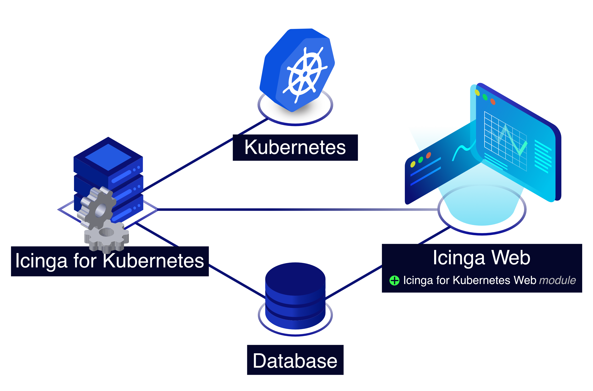
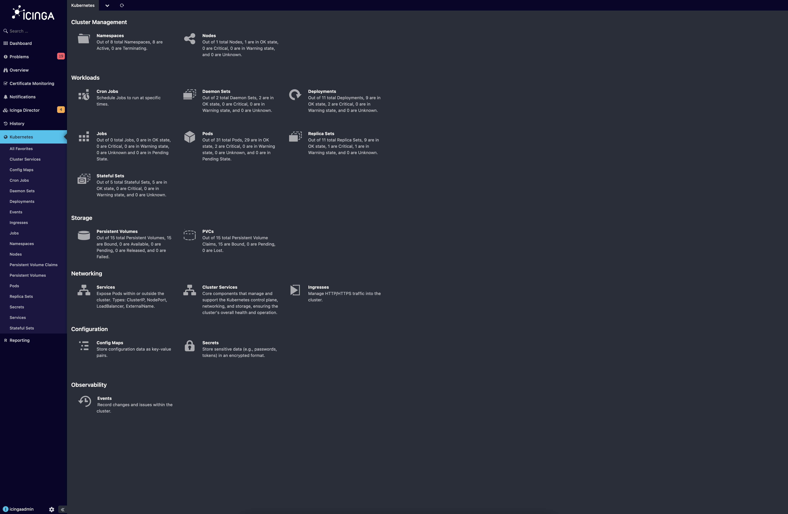
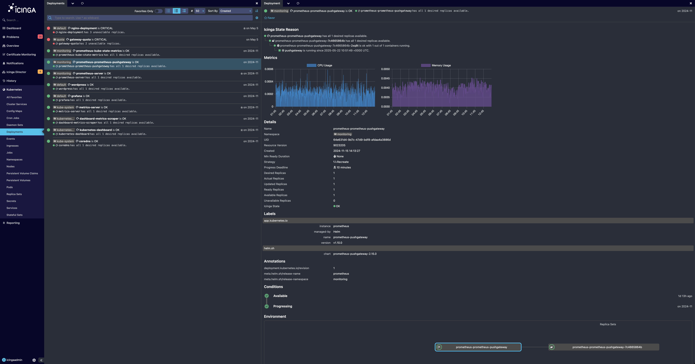
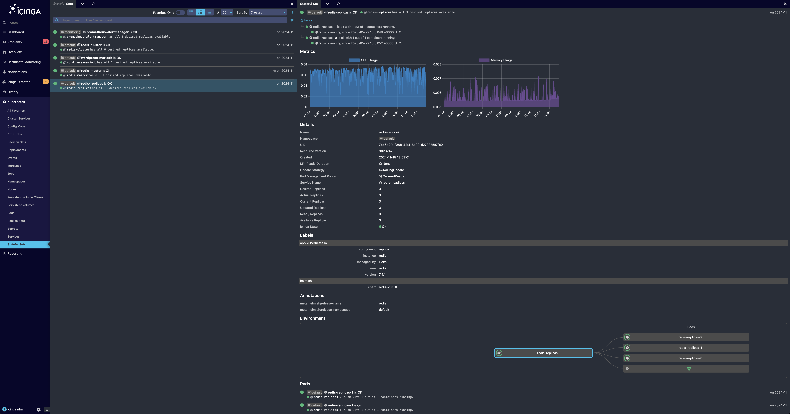
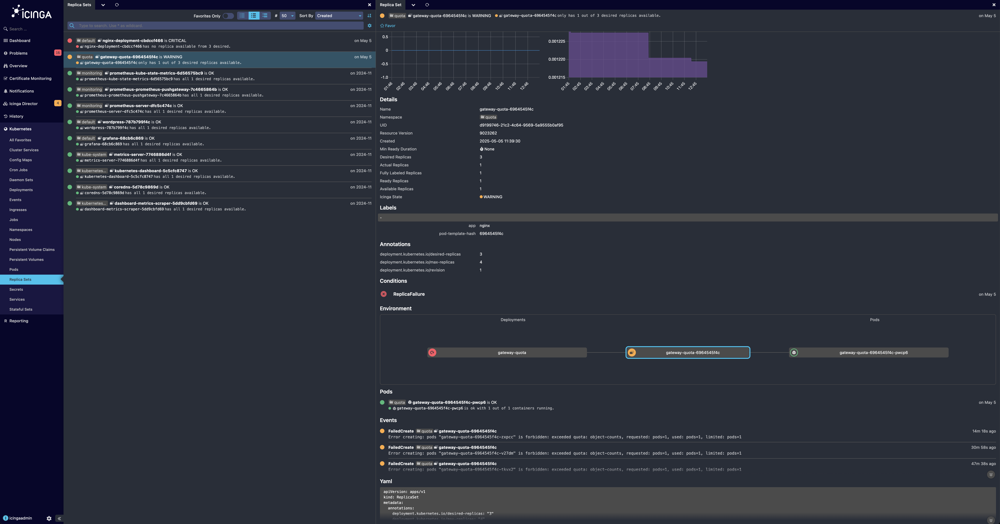
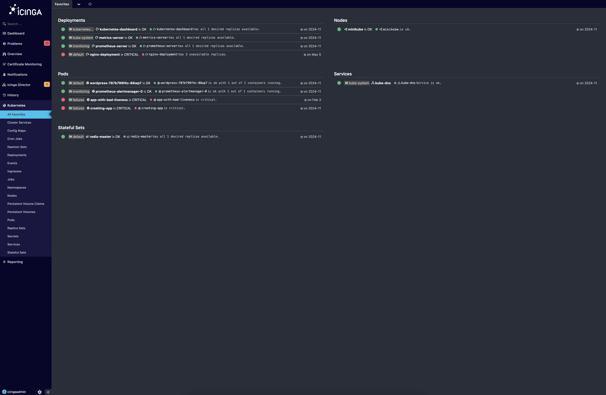

# Icinga for Kubernetes Web

Icinga for Kubernetes is a set of components for monitoring and visualizing Kubernetes resources,
consisting of

* the [Icinga for Kubernetes daemon](https://icinga.com/docs/icinga-kubernetes),
  which uses the Kubernetes API to monitor the configuration and
  status changes of Kubernetes resources synchronizing every change in a database, and
* Icinga for Kubernetes Web, which connects to the database for visualizing Kubernetes resources and their state.

Though any of the Icinga for Kubernetes components can run either inside or outside Kubernetes clusters,
including the database, common setup approaches include the following:

* All components run inside a Kubernetes cluster.
* All components run outside a Kubernetes cluster.
* Only the Icinga for Kubernetes daemon runs inside a Kubernetes cluster,
  requiring configuration for an external service to connect to the database outside the cluster.

## Multi-Cluster Support

Icinga for Kubernetes supports multiple Kubernetes clusters by deploying several daemons,
each connecting to a different cluster but writing data into the same database.
The web interface accesses this database to display resource information and state,
offering the flexibility to view aggregated data from all clusters or focus on a specific cluster.
This setup ensures scalable monitoring and a unified view of resources across multiple Kubernetes environments.

## Vision and Roadmap

Although every Kubernetes cluster is different, Icinga for Kubernetes aims to provide a zero-configuration baseline for
monitoring Kubernetes. Our goal is to make it easy to understand the complete state of clusters, including resources,
workloads, relations, and performance. We strive to offer comprehensive monitoring that provides a clear and
intuitive view of clusters' health, helping to identify problems and potential bottlenecks.

The Kubernetes API is leveraged to retrieve information about resources and watch ongoing changes.
This data is stored in a database to reduce pressure on the Kubernetes API and
to enable powerful filtering through a relational model.

Currently, Icinga for Kubernetes utilizes all available information from the Kubernetes API to
determine the state of resources and clusters. In future versions, we plan to integrate metrics.

We welcome your ideas on what should be included in the baseline.
Do not hesitate to share your key metrics, important thresholds,
or correlations used to set up alarms in your environments.

## Installation

To install Icinga for Kubernetes Web see [Installation](02-Installation.md).

## License

Icinga for Kubernetes Web and the Icinga for Kubernetes Web documentation are licensed under the terms of the
GNU Affero General Public License Version 3.
