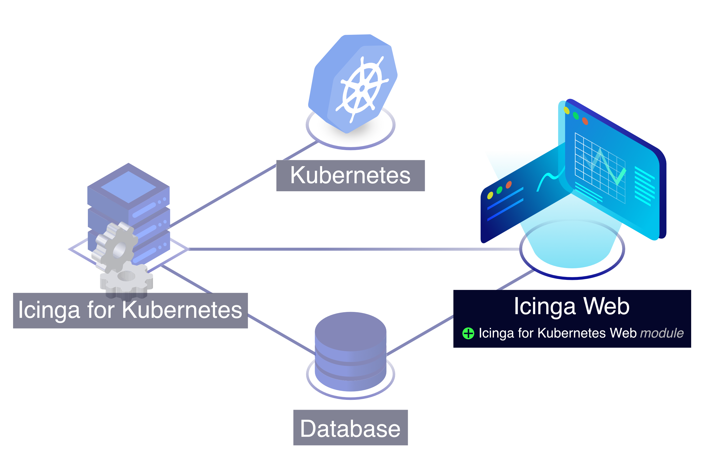

<!--  -->
# Installing Icinga for Kubernetes Web

## Using Helm

For deploying Icinga for Kubernetes and its dependencies within a Kubernetes cluster,
the recommended approach is to use our
[Helm charts](https://github.com/Icinga/helm-charts/tree/main/charts/icinga-stack) to
deploy a ready-to-use Icinga stack.

## Installing via Package

Though any of the Icinga for Kubernetes components can run either inside or outside Kubernetes clusters,
including the database, common setup approaches include the following:

* All components run inside a Kubernetes cluster.
* All components run outside a Kubernetes cluster.
* Only the Icinga for Kubernetes daemon runs inside a Kubernetes cluster,
  requiring configuration for an external service to connect to the database outside the cluster.

To install Icinga for Kubernetes outside of a Kubernetes cluster,
it is recommended to use prebuilt packages available for all supported platforms from
our official release repository.
Follow the steps provided for your target operating system to set up the repository and
install Icinga for Kubernetes Web.

Before installing Icinga for Kubernetes Web, make sure you have installed
[Icinga for Kubernetes](https://icinga.com/docs/icinga-kubernetes).
<!--  -->
<!--  -->

If the [repository](https://packages.icinga.com) is not configured yet, please add it first.
Then use your distribution's package manager to install the `icinga-kubernetes-web` package
or install [from source](02-Installation.md.d/From-Source.md).
<!--  -->

This concludes the installation. Now proceed with the [configuration](03-Configuration.md).
<!--  -->
